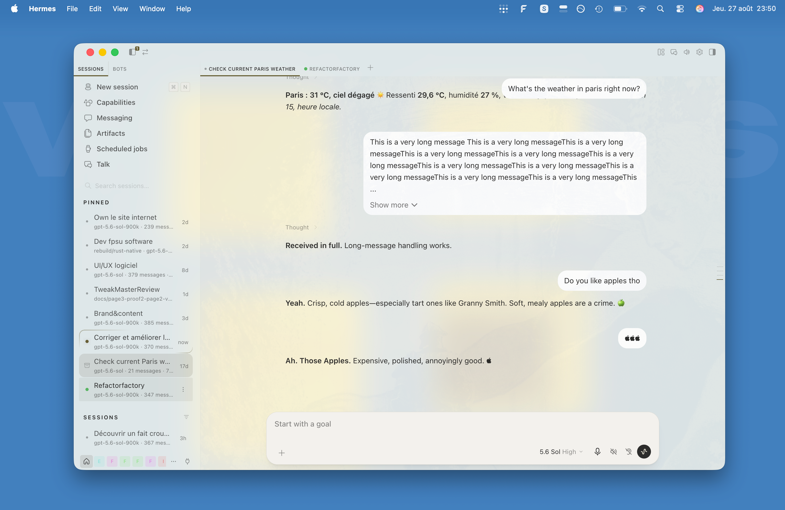

# Codex Skin for Hermes Desktop



Codex Skin gives Hermes Desktop a Codex-inspired chat layout while preserving Hermes' native behavior. It supports native Hermes themes and the native Glass background, while the original Codex colors remain available through the **Codex Skin** theme in Appearance settings.

> [!IMPORTANT]
> This project is an independent community plugin. It is not affiliated with or endorsed by Nous Research or OpenAI.

## Status

**Stable.** Version 1.2.0 has been exercised in Hermes Desktop and is covered by an automated regression suite. It uses Hermes' supported desktop plugin entry point, but some styling depends on internal DOM attributes that may change in future Hermes releases.

## What it changes

- Native Hermes theme colors and Glass/Clear window translucency, without changing the Codex layout or typography
- A selectable **Codex Skin** theme in **Settings → Appearance** for the original Codex light and dark palettes
- Chat typography, spacing, sidebar, composer, Queue, bubbles, menus and loaders
- Codex-style model name in the composer
- Hermes' native model and Thinking Level menus after clicking the model name
- Hermes' native auto-speak and wake-word controls inside the composer
- Cleaner styling for Hermes' native **Voice dictation** and **Reading aloud** surfaces
- Dynamic Voice dictation and Reading aloud lanes above Tasks, Queue and Background
- Pixel-matched 736 CSS px Codex composer, with an optional native-width Hermes mode
- User-message clamp at 4 lines / 110 px, with a **Show more** control for longer messages
- Styling for Tasks, Background activity, Clarify, Approval and media surfaces

## Adjustable settings

| Setting | Values | Default | Where |
| --- | --- | --- | --- |
| Codex Skin | On / Off | On after installation | **Settings → Plugins** |
| Theme | Codex Skin / any native Hermes theme | Hermes choice | **Settings → Appearance** |
| Composer width | Codex / Hermes | Codex | Command palette |

Turning **Codex Skin** off restores Hermes' normal appearance.

### Composer width

Open the command palette and run **Codex Skin: Composer width**. The row shows the active mode and the choice persists locally.

- **Codex** uses the measured Codex width of **736 CSS px**, with responsive 16 px minimum side gutters.
- **Hermes** restores Hermes' native full-width composer and conversation column.

The `+` menu above the composer follows the rendered composer width in both modes.

## Screenshots

### Codex Skin theme


### Composer width setting


### Voice dictation and Reading aloud


### Tasks

*Demo weather steps used only to show the Tasks layout.*


## What it deliberately does not do

- It does not replace Hermes' model or Thinking Level selection logic.
- It preserves Hermes' native assistant-turn rendering.
- It does not own, persist, replay, remove or migrate queued prompts; Queue behavior remains Hermes-native.
- It does not modify Hermes source files.
- It does not use a backend, network requests or external assets.

## Requirements

- Hermes Desktop with the [Desktop Plugin SDK](https://hermes-agent.nousresearch.com/docs/developer-guide/desktop-plugin-sdk)
- A local Hermes profile directory

Current Hermes Desktop releases can install Git repositories directly. Older releases can still use the manual disk install below.

## Install

### Current Hermes Desktop

Open **Settings → Plugins → Install plugin** and paste this exact repository subdirectory:

```text
FPSUnleashed/hermes-codex-skin/codex-chat-look
```

The `/codex-chat-look` suffix matters because the desktop entry lives in that folder. Do not save or paste GitHub's `/blob/.../plugin.js` web page as the plugin file: it is HTML and Hermes will report `Unexpected token '<'` when it tries to load it.

### Manual install on macOS / Linux

```sh
PLUGIN_DIR="${HERMES_HOME:-$HOME/.hermes}/desktop-plugins/codex-chat-look"
mkdir -p "$PLUGIN_DIR"
curl -fsSL \
  https://raw.githubusercontent.com/FPSUnleashed/hermes-codex-skin/main/codex-chat-look/plugin.js \
  -o "$PLUGIN_DIR/plugin.js"
```

For a named profile, use:

```text
~/.hermes/profiles/<profile>/desktop-plugins/codex-chat-look/plugin.js
```

### Manual install on Windows PowerShell

```powershell
$pluginDir = Join-Path $HOME ".hermes\desktop-plugins\codex-chat-look"
New-Item -ItemType Directory -Force -Path $pluginDir | Out-Null
Invoke-WebRequest `
  -Uri "https://raw.githubusercontent.com/FPSUnleashed/hermes-codex-skin/main/codex-chat-look/plugin.js" `
  -OutFile (Join-Path $pluginDir "plugin.js")
```

Hermes watches the plugin folder and should load the file automatically. If it does not, open the command palette and run **Reload desktop plugins**. You can enable or disable it live under **Settings → Plugins**.

> [!IMPORTANT]
> Installing or enabling the plugin and selecting its theme are separate steps. After installation, open **Settings → Appearance** and select **Codex Skin** for the original Codex light/dark palette, or keep any other Hermes theme to use its colors with the Codex layout and typography.

## Update

Run the relevant install command again. Hermes hot-reloads the replaced file. Compare its SHA-256 against [`CHECKSUMS.sha256`](CHECKSUMS.sha256) when you want byte-level verification.

## Uninstall

Disable **Codex Skin** under **Settings → Plugins**, then remove its folder:

### macOS / Linux

```sh
rm -rf "${HERMES_HOME:-$HOME/.hermes}/desktop-plugins/codex-chat-look"
```

### Windows PowerShell

```powershell
Remove-Item -Recurse -Force (Join-Path $HOME ".hermes\desktop-plugins\codex-chat-look")
```

Run **Reload desktop plugins** if Hermes does not unload it automatically.

## Privacy and authority

Desktop plugins execute inside the Hermes renderer and therefore carry the same local authority as the app. Review local plugins before installing them.

This plugin performs no network requests and stores no message text, prompt hashes or content fingerprints. It keeps a bounded local list of profile/session/message IDs for user messages that were manually expanded, capped at 250 entries, plus the **Composer width** preference.

## Compatibility

The plugin is scoped behind `html[data-codex-chat-look='true']` and cleans up its runtime markers when disabled. It is self-contained, but it styles internal Hermes surfaces. A future Hermes UI update can require selector maintenance even when the official plugin loader remains compatible.

The internal plugin ID, theme ID and installation folder remain `codex-chat-look` / `codex-chat` so existing installations update in place.

### Known Hermes Queue issue

Queue persistence and transcript rehydration are owned by Hermes Desktop, not this skin. Some current Hermes builds can lose the visible queued rows after switching or reloading a compressed chat, or fail to show a message that was sent while that chat was in the background. Codex Skin does not write Queue data and this release does not claim to fix that native session-routing bug.

## Contributing

See [CONTRIBUTING.md](CONTRIBUTING.md). Bug reports should include the Hermes version, operating system, exact reproduction steps and a screenshot with private content removed.

## License

[MIT](LICENSE)
