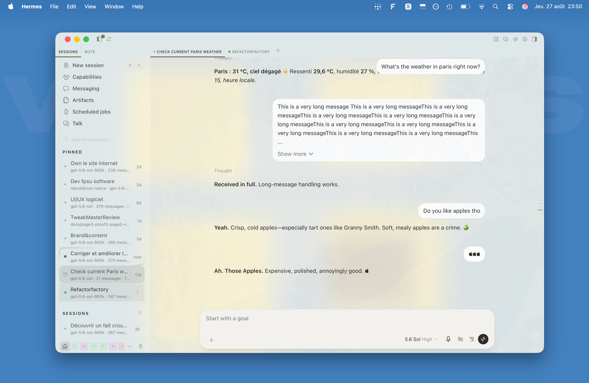

# Codex Skin for Hermes Desktop



Codex Skin gives Hermes Desktop a Codex-inspired chat layout while preserving Hermes' native behavior. It supports native Hermes themes and the native Glass background, while the original Codex colors remain available through the **Codex Skin** theme in Appearance settings.

> [!IMPORTANT]
> This project is an independent community plugin. It is not affiliated with or endorsed by Nous Research or OpenAI.

## Status

Version 1.9.1 fixes upper-button clicks on macOS, clears Inbox completion dots when the latest reply is visible, and matches sidebar captions to chat tabs. Inbox still keeps chats that need attention until you settle them, with Snooze for temporary hiding. New work brings older, settled and pinned chats back. Cron sessions are excluded. It retains the stable top bar, native theme support, release-history images and one-click skin updates. The plugin uses Hermes' desktop entry point, but some styling and the local update bridge depend on Desktop interfaces that can change between Hermes releases.

> [!IMPORTANT]
> This version targets the updated Hermes Desktop layout. If you are keeping the previous layout, use [Codex Skin v1.6.0](https://github.com/FPSUnleashed/hermes-codex-skin/releases/tag/v1.6.0) instead. Use a pinned download for that version, not `main`. See [Compatibility](#compatibility).

`main` can receive tested improvements between tagged releases. Merging changes does not create a new release or replace existing release assets. This README describes the current source, which may include changes not yet included in a tagged release.

Inbox is included in the [v1.9.0 release](https://github.com/FPSUnleashed/hermes-codex-skin/releases/tag/v1.9.0).

## What it changes

- A small blue update button beside the composer's `+` menu when a newer stable release is available. Hover to browse GitHub release notes with images; click to update and hot-reload the skin.
- Native Hermes theme colors and Glass/Clear window translucency, without changing the Codex layout or typography
- A selectable **Codex Skin** theme in **Settings → Appearance** for the original Codex light and dark palettes
- Chat typography, spacing, sidebar, composer, Queue, bubbles, menus and loaders
- Rounded, theme-aware session-control error notices with native dismissal and readable text on narrow panes
- Native model names in the composer, without renaming or changing capitalization
- Hermes' native model and Thinking Level menus after clicking the model name
- Hermes' native auto-speak and wake-word controls inside the composer
- Cleaner styling for Hermes' native **Voice dictation** and **Reading aloud** surfaces
- Dynamic Voice dictation and Reading aloud lanes above Tasks, Queue and Background
- Pixel-matched 736 CSS px Codex composer, with an optional native-width Hermes mode
- Optional unpinned user messages while keeping Hermes' pinned behavior as the default
- Optional **Clean transcript** mode that hides safely identified settled execution details after the final response while keeping live progress and important content visible
- An optional **Inbox** above Pinned and Sessions, enabled by default, for threads that still need attention. Settle removes a thread only from Inbox and preserves its pin and history.
- User-message clamp at 4 lines / 110 px, with a **Show more** control for longer messages
- Styling for Tasks, Background activity, Clarify, Approval and media surfaces
- Styling that stays active when navigating between chat, Capabilities, Messaging and Artifacts
- Compact Attach and `/` completion menus, smoother Patched file cards and cleaner sidebar/chat chrome
- Square image previews, right-aligned sent attachments and Codex-style browser controls
- Hidden Sessions/Bots minimize button: use the full sidebar toggle instead. Restore remains available for previously minimized layouts.
- Left-side history ticks with a proximity hover effect and one question/reply preview at a time. Clicking a tick keeps Hermes' native jump behavior.

History ticks use quieter theme-aware colors and more vertical spacing. The current-message marker gives way to the hovered marker without dimming ordinary idle ticks. The pointer-driven wave responds without a trailing width animation, and the rail hides when its own chat pane is 862 CSS pixels wide or narrower. Native click targets, keyboard navigation and virtualized scrolling remain intact.

History previews use the rendered exchange when available. Older turns in the main chat can use a read-only history request; if the plugin cannot safely match an exchange, it shows the question only. Split panes never borrow another pane's response. Disabling the plugin restores the native timeline.

## Adjustable settings

| Setting | Values | Default | Where |
| --- | --- | --- | --- |
| Codex Skin | On / Off | On after installation | **Capabilities → Plugins** |
| Theme | Codex Skin / any native Hermes theme | Hermes choice | **Settings → Appearance** |
| Composer width | Codex / Hermes | Codex | Command palette |
| Pinned user messages | Hermes / Off | Hermes | Command palette |
| Clean transcript | On / Off | Off | Command palette |
| Inbox | On / Off | On | Command palette |

### Recommended settings

For the recommended Codex-style setup, choose these values through the command palette. These are recommendations, not changes to the defaults listed above.

- **Composer width:** Codex
- **Pinned user messages:** Off
- **Clean transcript:** On

Turning **Codex Skin** off restores Hermes' normal appearance.

### Composer width

Open the command palette and run **Codex Skin: Composer width**. The row shows the active mode and the choice persists locally.

- **Codex** uses the measured Codex width of **736 CSS px**, with responsive 16 px minimum side gutters.
- **Hermes** restores Hermes' native full-width composer and conversation column.

The `+` menu above the composer follows the rendered composer width in both modes.

### Pinned user messages

Open the command palette and run **Codex Skin: Pinned user messages**. The row shows the active mode and the choice persists locally.

- **Hermes** preserves Hermes' native behavior, where the latest user message stays pinned at the top while scrolling.
- **Off** lets every user message scroll normally with the rest of the conversation.

### Clean transcript

Open the command palette and run **Codex Skin: Clean transcript**. The row shows the active mode and the choice persists locally.

Clean transcript defaults to **Off**. An existing **Off** or **On** choice is preserved.

- **Off** preserves Hermes' complete native transcript presentation.
- **On** keeps all live progress visible, then hides safely identified settled tool calls, thinking chrome, changed-file summaries, system notices and interim replies after the final response mounts. User messages, final answers, generated images, artifacts and alerts stay visible.

Older content loaded through **Show previous messages** can remain visible when Hermes no longer exposes enough information to distinguish a final answer from an interim reply. The plugin leaves uncertain content visible rather than risk hiding a real final answer.

### Inbox

Open the command palette and run **Codex Skin: Inbox** to switch it On or Off. The preference persists locally; a missing preference defaults to On.

#### How to use it

Think of each thread as an independent task.

Once it's finished, click the **checkmark** to remove it from Inbox. **It isn't archived**, only hidden from Inbox. You can still find it in Sessions.

The goal is to have **an empty Inbox at the end of the day**.

Inbox is **enabled by default**, but you can turn it off whenever you want: open **Command + K** and select **Codex Skin: Inbox**.

I recommend keeping **Pinned** and **Sessions** collapsed so you can focus on your Inbox. Expand them whenever you need to find an older or pinned chat.

Inbox opens by default above Pinned and Sessions. Its heading and disclosure match the native sections. A chat enters Inbox when fresh, owner-verified agent work is observed, even in an older chat. Cron sessions never enter Inbox: the filter uses Hermes' session `source` and, when present, immutable `created_source`, not titles or IDs. Known non-cron sources may differ when a chat moves between interfaces; missing or unknown provenance and conflicting ownership stay excluded. Creating an empty chat, opening or focusing a chat, reading history, pagination, unread marks and timestamps do not admit it. Admitted non-cron threads remain after work completes until **Settle**; **Snooze** hides them temporarily. Admission persists separately for each connection and profile, including threads older than the recent history page. Disconnected, stale or failed live reads cannot admit new work.

**Settle** removes a thread from Inbox without stopping work, archiving, deleting or unpinning it. A **Settled** badge on an already admitted, verified native session row offers **Un-settle** on hover or keyboard focus. The Settle check stays available on every admitted Inbox row, including while working, waiting for input, reading history, or when activity or metadata is unavailable. A compact **Settled** notice below the remaining threads offers **Undo** for **3000 ms**, with a theme-aware left-to-right progress bar. Only the latest successful settlement has a notice and Undo handle; earlier settlements remain saved. Undo restores that exact thread's attention without navigating. Failed storage writes do not hide the row or show a success notice. A subsequent verified new message/work event can reactivate a settled non-cron chat. Merely opening it, passive polling of the same running task, message-count growth, ongoing tool starts and completion cannot undo a manual Settle. Turning Inbox Off, changing connection/profile, unmounting or hot-reloading clears the temporary notice, not saved settlement.

**Snooze** hides a thread from Inbox until a chosen deadline, without stopping its task or changing its pin, history or settled state. The clock button opens a theme-aware dropdown containing only 15 minutes, 30 minutes, 1 hour, 3 hours and 1 day. Choosing a duration applies it immediately; clicking outside or pressing Escape dismisses the menu. The deadline persists locally across reloads. Opening a chat, background activity and hydration do not shorten it. A **Snoozed** badge on an admitted, verified row in Sessions or Pinned shows the deadline on hover and offers **Wake now** to cancel early. Expiry or cancellation restores an otherwise active admitted non-cron thread to Inbox without navigating.

Native row badges require a verified single connection/profile and a matching admitted thread. The current Desktop row slot exposes a durable ID but not its owner, so badges remain hidden in mixed-connection/profile lists rather than act on the wrong thread. Un-settle and Wake now remain available on verified row badges; no separate restore commands clutter the command palette. Known cron sessions are excluded even if an old admission or attention record exists.

Settling or snoozing the current thread opens the next Inbox thread, or a new chat if none remains in the loaded list. Acting on another thread does not navigate. Inbox scrolls without manual pagination controls. Previously work-admitted threads remain available even beyond the first history page. Pinned and Sessions stay below Inbox, including when expanded; neither section must be closed to expose Inbox. Turning Inbox Off restores native section controls and hides the Inbox badges without erasing settled state or snooze deadlines.

**Snooze** is on the left and appears only on hover or keyboard focus. The **Settle** check is on the right and stays visible at rest regardless of activity; its reserved slot keeps the title and Snooze in place. Real work uses a theme-foreground dot and the installed Hermes segmented contour around the whole row, not a rotating arc around the dot. Idle, reading and unknown activity states show no activity indicator. A successful terminal reply or the native unread marker produces the green completed dot; errors, interruptions and missing live status do not imply success. A parent handoff while observed subagents remain active also does not imply completion. Activity events require the exact source/profile and a verified stored/runtime identity; replayed and foreign-owner events are ignored. Reduced-motion keeps the working marker and a static contour.

Viewing the latest completed reply clears its green completion dot without settling the chat or removing it from Inbox. Reading an earlier reply does not clear a newer one. Fresh work re-arms the indicator for the next completion.

Session listing uses Hermes' native endpoint and follows its configured retention policy. Settle and Snooze themselves write only the plugin's local state and never archive a session.

Admission v2 keeps the old v1 admission store untouched as a backup but does not automatically promote its ambiguous creation/open/work entries. All existing Settle/Snooze records and aliases remain intact. A fresh verified non-cron work observation can admit such a thread; a previous manual Settle or active Snooze still applies. This is work-based admission, not an original-human-creator filter. Unknown source kinds require compatibility review before admission.

**Known limitation:** cron sessions are excluded, but cron-triggered work delivered into a regular chat may still appear as that chat's activity when Hermes does not expose its origin.

## Screenshots

These captures document earlier releases. Some details, including the former Titlebar autohide option, differ from v1.8.1.

### Version 1.5.0

Square image previews and the refined browser and composer in dark mode:


A light theme with the top bar hidden:


### Codex Skin theme


### Composer width setting


### Voice dictation and Reading aloud


### Tasks

*Demo weather steps used only to show the Tasks layout.*


## What it deliberately does not do

- It does not replace Hermes' model or Thinking Level selection logic.
- It preserves Hermes' native assistant-turn rendering.
- It does not own, persist, replay, remove or migrate queued prompts; Queue behavior remains Hermes-native.
- It does not modify Hermes source files.
- It does not run a separate backend. Update checks contact GitHub, and clicking the update button downloads the plugin's published release asset. History previews can use Hermes' native read-only session API.

## Requirements

- Hermes Desktop with the [Desktop Plugin SDK](https://hermes-agent.nousresearch.com/docs/developer-guide/desktop-plugin-sdk)
- A local Hermes profile directory

In-app updates require the Desktop shell's local plugin-folder, complete file-read and file-write capabilities, plus its plugin hot reload. The updater checks local file capabilities and verifies each hot reload before reporting success. Updating a remote Agent alone does not add them to an older Desktop shell.

Current Hermes Desktop releases can install Git repositories directly. Older releases can still use the manual disk install below.

## Install

### Current Hermes Desktop

Open **Capabilities → Plugins → Install plugin** and paste this exact repository subdirectory:

```text
FPSUnleashed/hermes-codex-skin/codex-chat-look
```

The `/codex-chat-look` suffix matters because the desktop entry lives in that folder. Do not save or paste GitHub's `/blob/.../plugin.js` web page as the plugin file: it is HTML and Hermes will report `Unexpected token '<'` when it tries to load it.

### Manual install on macOS / Linux

```sh
PLUGIN_DIR="${HERMES_HOME:-$HOME/.hermes}/desktop-plugins/codex-chat-look"
mkdir -p "$PLUGIN_DIR"
curl -fsSL \
  https://raw.githubusercontent.com/FPSUnleashed/hermes-codex-skin/main/codex-chat-look/plugin.js \
  -o "$PLUGIN_DIR/plugin.js"
```

Desktop plugins are app-level on current Hermes builds. Use the plugin folder on the computer running Hermes Desktop, even when the agent is remote; do not install the UI plugin only on the backend machine.

### Manual install on Windows PowerShell

```powershell
$pluginDir = Join-Path $HOME ".hermes\desktop-plugins\codex-chat-look"
New-Item -ItemType Directory -Force -Path $pluginDir | Out-Null
Invoke-WebRequest `
  -Uri "https://raw.githubusercontent.com/FPSUnleashed/hermes-codex-skin/main/codex-chat-look/plugin.js" `
  -OutFile (Join-Path $pluginDir "plugin.js")
```

Hermes watches the plugin folder and should load the file automatically. You can enable or disable it under **Capabilities → Plugins**. If the old appearance remains, use **Reload desktop plugins** where supported; some Hermes builds do not reevaluate an already-loaded plugin through that action, so a full app restart may be needed.

> [!IMPORTANT]
> Installing or enabling the plugin and selecting its theme are separate steps. After installation, open **Settings → Appearance** and select **Codex Skin** for the original Codex light/dark palette, or keep any other Hermes theme to use its colors with the Codex layout and typography.

## Update

**Install v1.8.0 or later once using your existing installation method to receive the updater.** Earlier versions cannot display the new button by themselves.

After that, the plugin checks the public GitHub release feed hourly and refreshes stale information when the app becomes active or reconnects. A small blue button appears beside `+` only when a newer stable release with a valid plugin asset is available. Hover to read the release history; click to download, verify and install it. The green check appears only after the new plugin has loaded, then the button disappears. Your skin settings remain unchanged.

Starting with v1.8.1, the hover menu renders Markdown images and HTML `img` elements from this repository's GitHub release assets/raw files and GitHub-hosted user attachments. Images load only after opening the menu, fit inside it without distortion and fall back to their description if unavailable. Other HTML and event handlers are never executed. An older installed version keeps its older menu renderer until the update has completed.

The updater resolves the local Desktop plugin folder, verifies the download's size, SHA-256 digest and build identity, and saves a rollback copy before replacing `plugin.js`. It does not execute release-note HTML. An update failure is shown on the control instead of claiming success.

The manual install commands remain available. If you are staying on the previous Desktop layout, keep the pinned v1.6.0 download instead of updating from `main`. Compare a source installation against [`CHECKSUMS.sha256`](CHECKSUMS.sha256) when you want byte-level verification.

The manual install commands above download from `main`, so running them can fetch improvements before the next tagged release. A merge alone does not replace a manually installed local file.

## Uninstall

Disable **Codex Skin** under **Capabilities → Plugins**, then remove its folder:

### macOS / Linux

```sh
rm -rf "${HERMES_HOME:-$HOME/.hermes}/desktop-plugins/codex-chat-look"
```

### Windows PowerShell

```powershell
Remove-Item -Recurse -Force (Join-Path $HOME ".hermes\desktop-plugins\codex-chat-look")
```

Run **Reload desktop plugins** if Hermes does not unload it automatically.

## Privacy and authority

Desktop plugins execute inside the Hermes renderer and therefore carry the same local authority as the app. Review local plugins before installing them.

The public updater contacts GitHub for release metadata, permitted release images when you open the hover menu and, on your update click, the selected plugin asset. No GitHub account is needed. GitHub receives normal network request information; no chat content is sent to it, and the plugin adds no analytics.

Locally, the plugin caches release notes/check times and update verification receipts, and saves staged/rollback plugin files. It stores no message text, prompt hashes or content fingerprints. History previews can make a read-only request through Hermes' own session API. It keeps a bounded local list of profile/session/message IDs for user messages that were manually expanded, capped at 250 entries, plus the **Composer width**, **Pinned user messages**, **Clean transcript** and **Inbox** preferences. Inbox stores settled state, snooze deadlines and message-count watermarks by source, profile and durable thread identity; these contain no message text.

## Compatibility

| Hermes Desktop layout | Codex Skin version |
| --- | --- |
| Desktop builds with the September 16, 2026 panel-header and virtualized-timeline changes ([Hermes commit 2efbbef](https://github.com/NousResearch/hermes-agent/commit/2efbbef981cc75ed6df6214ee6975a0ae0f418d3)) | v1.8.1; in-app updates additionally require the local capabilities described above |
| Older Desktop builds, including code from Hermes Agent 0.21.3 / v2026.9.14 or earlier | [v1.6.0](https://github.com/FPSUnleashed/hermes-codex-skin/releases/tag/v1.6.0) |

Titlebar autohide is not available in v1.8.1. Old saved values are ignored; the remaining skin settings and native Hermes window controls are preserved.

The updated header layout no longer needs a separate hide-and-reveal mechanism. Tabs and window controls now remain accessible directly, without the old hover-triggered transitions.

The v1.8.1 compatibility target is the Desktop build containing the September 16, 2026 layout and timeline changes, not a blanket remote Agent-version threshold. Hermes Agent and Hermes Desktop can update independently. This release has been tested against that updated layout only; it does not guarantee compatibility with all future builds.

### Staying on v1.6.0

Do not use the `main` install commands above on an older layout. Use the pinned file instead.

macOS / Linux:

```sh
PLUGIN_DIR="${HERMES_HOME:-$HOME/.hermes}/desktop-plugins/codex-chat-look"
mkdir -p "$PLUGIN_DIR"
curl -fsSL \
  https://raw.githubusercontent.com/FPSUnleashed/hermes-codex-skin/v1.6.0/codex-chat-look/plugin.js \
  -o "$PLUGIN_DIR/plugin.js"
```

Windows PowerShell:

```powershell
$pluginDir = Join-Path $HOME ".hermes\desktop-plugins\codex-chat-look"
New-Item -ItemType Directory -Force -Path $pluginDir | Out-Null
Invoke-WebRequest `
  -Uri "https://raw.githubusercontent.com/FPSUnleashed/hermes-codex-skin/v1.6.0/codex-chat-look/plugin.js" `
  -OutFile (Join-Path $pluginDir "plugin.js")
```

The plugin is scoped behind `html[data-codex-chat-look='true']` and cleans up its runtime markers when disabled. It is self-contained, but it styles internal Hermes surfaces. A future Hermes UI update can require selector maintenance even when the official plugin loader remains compatible.

The internal plugin ID, theme ID and installation folder remain `codex-chat-look` / `codex-chat` so existing installations update in place.

### Known Hermes Queue issue

Queue persistence and transcript rehydration are owned by Hermes Desktop, not this skin. Some current Hermes builds can lose the visible queued rows after switching or reloading a compressed chat, or fail to show a message that was sent while that chat was in the background. Codex Skin does not write Queue data and this release does not claim to fix that native session-routing bug.

## Contributing

See [CONTRIBUTING.md](CONTRIBUTING.md). Bug reports should include the Hermes version, operating system, exact reproduction steps and a screenshot with private content removed.

## License

[MIT](LICENSE)
