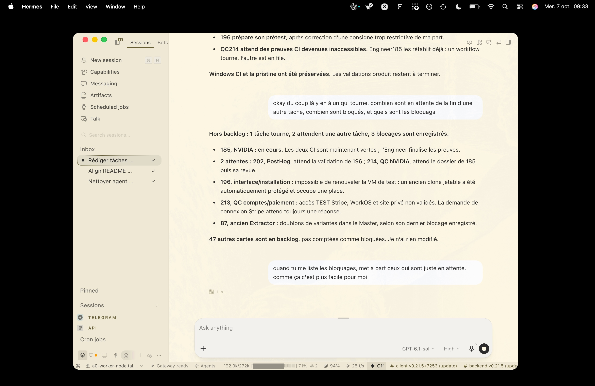
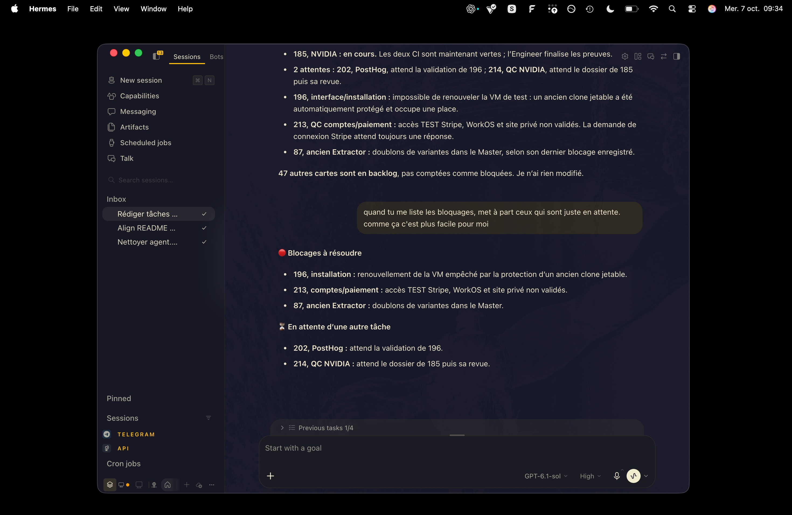
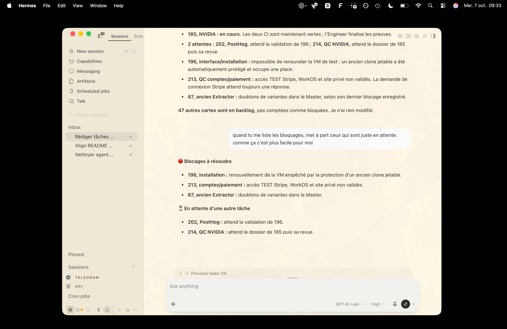
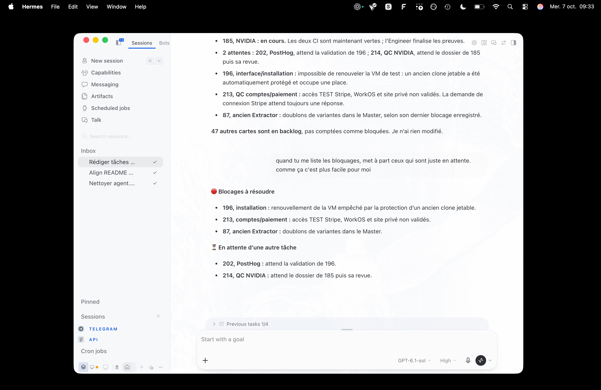

# Codex Skin for Hermes Desktop

<p>
  <a href="docs/images/skin-cream.jpg"></a>
  <a href="docs/images/skin-dark.jpg"></a>
  <a href="docs/images/skin-light.jpg"></a>
  <a href="docs/images/skin-white.jpg"></a>
</p>

Codex-inspired chat layout for Hermes Desktop, with native theme colors, Glass/Clear backgrounds, history previews and an optional task Inbox. Native model menus, voice controls and Queue behavior remain Hermes-owned.

> [!IMPORTANT]
> This project is an independent community plugin. It is not affiliated with or endorsed by Nous Research or OpenAI.

## Current release

**[v1.10.0](https://github.com/FPSUnleashed/hermes-codex-skin/releases/tag/v1.10.0)** adds two composer widths, refines browser controls and improves Inbox tracking when switching chats or running work and subagents in the background. See the [changelog](CHANGELOG.md) for the full history.

This page describes v1.10.0. `main` can receive tested improvements before the next tagged release; merging does not replace existing release assets. The manual commands below are pinned to v1.10.0.

**Older Desktop layout?** Use [v1.6.0](https://github.com/FPSUnleashed/hermes-codex-skin/releases/tag/v1.6.0), not v1.10.0 or `main`. See [Compatibility](#compatibility).

## Install

Requires Hermes Desktop with the [Desktop Plugin SDK](https://hermes-agent.nousresearch.com/docs/developer-guide/desktop-plugin-sdk) and a writable local plugin folder. Install on the computer running **Desktop**, not only on a remote Agent.

### Current Hermes Desktop

Open **Capabilities → Plugins → Install plugin** and paste this exact repository subdirectory:

```text
FPSUnleashed/hermes-codex-skin/codex-chat-look
```

This repository path is not pinned to v1.10.0; `main` may include newer improvements. For an exact stable version, use the pinned manual download below. Keep the `/codex-chat-look` suffix; do not use a GitHub `/blob/.../plugin.js` HTML page as the plugin file.

### Manual install on macOS / Linux

```sh
PLUGIN_DIR="${HERMES_HOME:-$HOME/.hermes}/desktop-plugins/codex-chat-look"
mkdir -p "$PLUGIN_DIR"
curl -fsSL \
  https://raw.githubusercontent.com/FPSUnleashed/hermes-codex-skin/v1.10.0/codex-chat-look/plugin.js \
  -o "$PLUGIN_DIR/plugin.js"
```

### Manual install on Windows PowerShell

```powershell
$pluginDir = Join-Path $HOME ".hermes\desktop-plugins\codex-chat-look"
New-Item -ItemType Directory -Force -Path $pluginDir | Out-Null
Invoke-WebRequest `
  -Uri "https://raw.githubusercontent.com/FPSUnleashed/hermes-codex-skin/v1.10.0/codex-chat-look/plugin.js" `
  -OutFile (Join-Path $pluginDir "plugin.js")
```

Hermes watches the plugin folder. Enable the skin under **Capabilities → Plugins**. If the old appearance remains, use **Reload desktop plugins** where supported; older builds may need an app restart to reevaluate an already-loaded file.

To verify a manual download, use the [checksums from the same tag](https://github.com/FPSUnleashed/hermes-codex-skin/blob/v1.10.0/CHECKSUMS.sha256), not a moving `main` checksum.

## Adjustable settings

Open the command palette and search for **Codex Skin:**. Choices persist locally.

| Setting | Values | Default |
| --- | --- | --- |
| Composer width | Codex / Codex +20 % / Codex +40 % / Hermes | Codex |
| Pinned user messages | Hermes / Off | Hermes |
| Clean transcript | On / Off | Off |
| Inbox | On / Off | On |

Enable or disable the skin under **Capabilities → Plugins**. Under **Settings → Appearance**, choose **Codex Skin** for the original Codex palette, or keep your native Hermes theme. Installing the plugin does not select its theme.

For the recommended Codex-style setup, use **Composer width: Codex**, **Pinned user messages: Off** and **Clean transcript: On**. These recommendations do not change the defaults.

**Clean transcript** keeps live progress visible, then hides safely identified execution details after the final reply. Final answers, user messages, media, artifacts and alerts remain visible. Uncertain older content stays visible.

See [detailed settings and history navigation](docs/usage.md) for widths and behavior.

## Inbox

Think of each thread as an independent task. Inbox appears above Pinned and Sessions and is **On by default**. Verified new work adds a chat; opening an empty chat or reading history does not.

- **Settle:** click the checkmark when a task is finished. It hides the thread from Inbox without stopping, archiving, deleting or unpinning it. The latest settlement offers Undo for three seconds. New work can bring the thread back.
- **Snooze:** hide it for 15 minutes, 30 minutes, 1 hour, 3 hours or 1 day without stopping its work.
- Settling or snoozing the current thread opens the next Inbox thread, or a new chat when none remains in the loaded list.

The goal is to have **an empty Inbox at the end of the day**.

I recommend keeping Pinned and Sessions collapsed to focus on Inbox. Expand Sessions for older chats and Hermes' full native context menu. Turn Inbox off through **Codex Skin: Inbox** without erasing saved Settle/Snooze state.

**Known limitation:** cron sessions are excluded, but cron-triggered work delivered into a regular chat may still appear as that chat's activity when Hermes does not expose its origin.

Restore badges are hidden when a row's connection/profile cannot be verified. See the [Inbox design note](docs/inbox.md) for ownership checks, activity indicators and persistence.

## Update

On supported Desktop builds, the plugin checks GitHub for stable releases on launch, hourly, and when stale information needs refreshing on app activation or reconnection. **Downloading and installing requires your click.**

A small blue button appears beside the composer's `+` when an update is available. Hover to read release notes; click to update. The updater verifies the download, saves a rollback copy and confirms hot reload before showing success. Your settings stay unchanged.

In-app updates require Desktop's local plugin-folder, file-read/write and hot-reload capabilities. Updating only a remote Agent does not upgrade the Desktop shell. Versions before v1.8.0 need one manual update to receive the updater.

Verification and trust limits are documented in [SECURITY.md](SECURITY.md).

## Uninstall

Disable **Codex Skin** under **Capabilities → Plugins** to restore Hermes' normal appearance. To remove it from disk, follow the [uninstall commands](docs/usage.md#uninstall).

## Privacy and authority

The plugin has renderer-level app authority, not a sandbox. It has no separate backend and does not modify Hermes source files or take ownership of Queue data.

GitHub receives requests for release metadata, permitted images when you open the update menu and the plugin asset when you click to update. No chat content is sent to GitHub; the plugin adds no analytics. History previews and Inbox use Hermes' own session APIs.

Settings, thread identifiers, attention state and update receipts/files are stored locally, not message text or content fingerprints. See [SECURITY.md](SECURITY.md) for the full trust and storage model.

## Compatibility

v1.10.0 targets the updated Desktop layout introduced by the September 16, 2026 panel-header and virtualized-timeline changes ([Hermes commit 2efbbef](https://github.com/NousResearch/hermes-agent/commit/2efbbef981cc75ed6df6214ee6975a0ae0f418d3)). The skin styles internal Desktop elements, so later UI changes can require a compatibility update. This is not a guarantee for every future Hermes build.

**Hermes Agent and Hermes Desktop can update independently.** A backend version alone does not establish the Desktop layout or updater capabilities.

For the older layout, including Desktop code from Hermes Agent 0.21.3 / v2026.9.14 or earlier, use the [pinned v1.6.0 instructions](docs/usage.md#older-desktop-layout-v160). Keep that version while staying on the older layout.

Titlebar autohide was removed because the updated header keeps tabs and window controls directly accessible. Old saved values are ignored. The internal plugin/folder ID remains `codex-chat-look`, and the theme ID remains `codex-chat`, preserving existing installations.

## More information

- [Detailed settings, older installs and historical screenshots](docs/usage.md). The archived captures show earlier releases, not v1.10.0.
- [Inbox design and behavior](docs/inbox.md)
- [Security policy](SECURITY.md)
- [Contributing](CONTRIBUTING.md). Skin bugs belong here; Hermes-native bugs belong upstream, not in skin workarounds.
- [MIT license](LICENSE)
